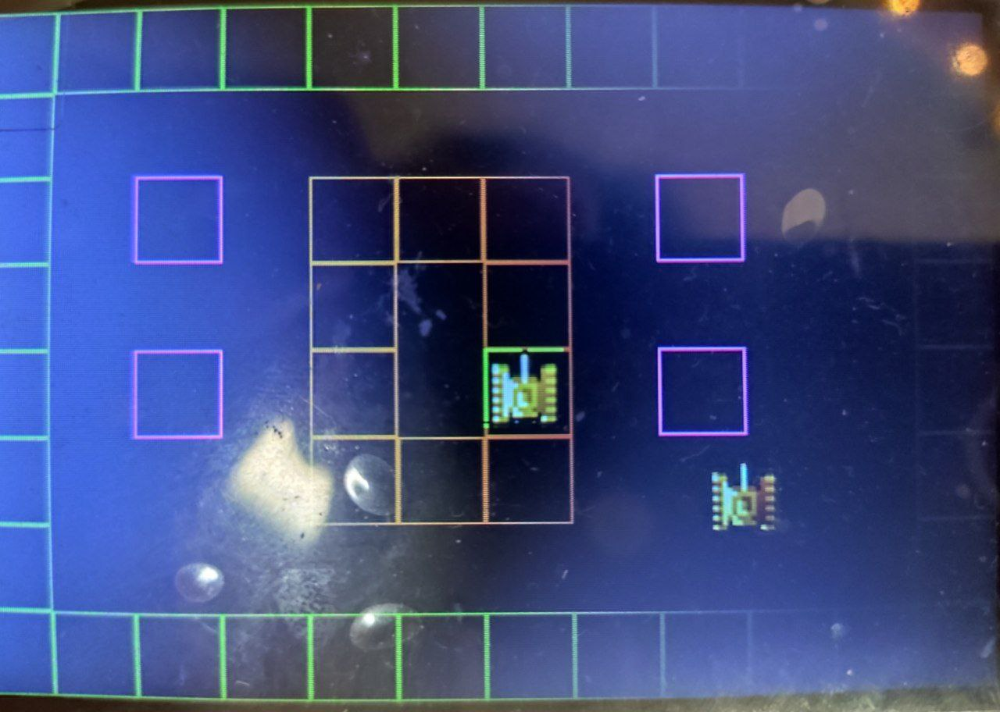

# Проект: Игра в танки на ESP32 и TFT дисплее (480x320)

#### Техническое задание (ТЗ)

#### 1. Цель проекта
Разработать игру «Танки» (аналог классической Battle City) для микроконтроллера ESP32 с выводом графики на TFT дисплей 480x320.

#### 2. Целевая платформа

| Компонент | Модель | Характеристики |
|-----------|--------|----------------|
| Микроконтроллер | ESP32 | ESP-WROOM-32, 240MHz, 320KB RAM, 4МБ Flash|
| Дисплей | TFT 3.5" / 3.95" | Разрешение 480x320, контроллер **ILI9488**, SPI интерфейс |
| Ввод | Физические кнопки | 9 кнопок (Вверх, Вниз, Влево, Вправо, Стрельба, Старт, доплнительный кнопки) |

#### 3. Функциональные требования

#### 3.1. Механика
- [x] Управление танком игрока (вперед/назад/повороты)
- [ ] Стрельба снарядами
- [ ] Вражеские танки(боты)
- [ ] Разрушаемые/неразрушаемые стены (кирпичные)
- [ ] База игрока (орел)
- [ ] Бонусы (звезда, лопата, каска и т.д.)

#### 3.2. Графика и отображение
- [ ] Рендеринг игрового поля 12x8 клеток (размер клетки 40x40 пикселя)
- [ ] Спрайты: игрок, враги, снаряды, стены
- [ ] Счет игрока и количество жизней
- [ ] Текущий уровень


### 4 Технологический стек

В качестве среды разработки была выбрана **PlatformIO**, которая облегчает работы с библиотеками и конфигурацией проекта

В проекте используется библиотеки: SPI.h TFT_eSPI.h для работы с дисплеем

<details>
<summary><b><span style="color: #d86812;">platformio.ini</span> <span style="color: #164542;">(раскрыть код)</span></b></summary>


```cpp
[env]
framework = arduino
monitor_speed = 115200
lib_deps = 

[env:esp32doit-devkit-v1]
platform = espressif32
board = esp32doit-devkit-v1
upload_speed = 115200
upload_port = COM9
lib_deps = bodmer/TFT_eSPI@^2.5.43
board_build.partitions = huge_app.csv 
build_unflags = 
	-std=gnu++11
	-std=c++11
	-std=gnu++0x
	-std=c++0x
build_flags = 
	-std=gnu++14

```
</details>


Проект пишется на C++, что удобно для описания сущностей таких как танк, пуля, стена, как классы с наследованием. Помимо этого используемые библиотеки(и большинство библиотек для esp32) написаны на C++, что позволит местами упростить работу над проектом и не писать "велосипед".


# Этапы разработки
* Реализовать класс Tank, описывающий базовую механику танков по полю.
<details>
<summary><b><span style="color: #475614;">class Tank</span> <span style="color: #164542;">(раскрыть код)</span></b></summary>


```cpp
class Tank {
    const size_t max_health_, max_ammunition_; 
    size_t health_, ammunition_; 
    size_t x_pos, y_pos; // position of the tank on the board
    size_t speed_;

    TankDirection direction_ = TankDirection::UP;

    TFT_eSPI& tft_;
    TFT_eSprite* tank_sprite_;
    uint16_t background_buffer_[DEFAULT_TANK_WIDTH * DEFAULT_TANK_HEIGHT]; // buffer to store the background pixels before drawing the tank

    public:
        Tank(size_t x_pos, size_t y_pos, size_t health, size_t ammunition, size_t speed, TFT_eSPI& tft) : //add try/catch module
        tft_(tft),
        speed_(speed),
        x_pos(x_pos),                y_pos(y_pos),
        max_health_(health),         health_(health),
        max_ammunition_(ammunition), ammunition_(ammunition) { 
            tank_sprite_ = new TFT_eSprite(&tft);
            tank_sprite_->createSprite(DEFAULT_TANK_WIDTH, DEFAULT_TANK_HEIGHT);
            tank_sprite_->setSwapBytes(true);
            tank_sprite_->pushImage(0, 0, DEFAULT_TANK_WIDTH, DEFAULT_TANK_HEIGHT, default_tank_up);

            tft.readRect(x_pos, y_pos, tank_sprite_->width(), tank_sprite_->height(), background_buffer_); // storing buffer of the background pixels before drawing the tank
        };

        ~Tank() {
            delete tank_sprite_;
        }

        void show(void);
        void move(int x, int y);

        void set_position(size_t x, size_t y);
        void set_direction(enum TankDirection direction);  

        size_t get_x_pos() const;
        size_t get_y_pos() const;

        size_t get_speed() const;
        size_t get_health() const;
        size_t get_ammunition() const;
        size_t get_max_health() const;
        size_t get_max_ammunition() const;
}; 
```
</details>

* Добавление окружения и взаимодействия объектов с ним
* Реализация физических механик, которых нет в оригинале игры Battle City


Текущий прогресс
